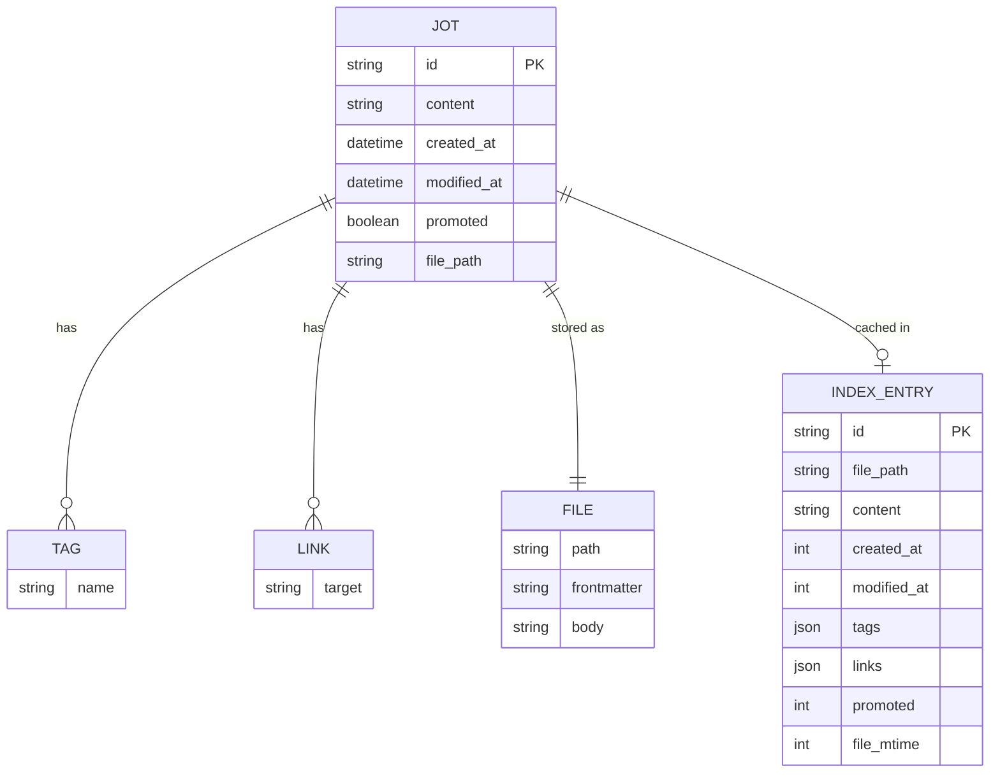

# Data Model: Jot Storage & Quick Jot Interface

**Date**: 2026-01-19
**Phase**: 1 (Design & Contracts)

---

## Entity Overview



---

## 1. Jot Entity

**Description**: A single note fragment captured by the user

**Storage**: Markdown file with YAML frontmatter

### 1.1 Rust Struct

```rust
use serde::{Deserialize, Serialize};
use chrono::{DateTime, Utc};

#[derive(Debug, Clone, Serialize, Deserialize)]
pub struct Jot {
    /// Unique identifier: "jot-YYYY-MM-DD-HHMMSS-XXXX"
    pub id: String,

    /// The jot text (without frontmatter)
    pub content: String,

    /// When the jot was created (ISO 8601)
    pub created_at: DateTime<Utc>,

    /// When the jot was last modified (ISO 8601)
    pub modified_at: DateTime<Utc>,

    /// Extracted tags (without # prefix)
    pub tags: Vec<String>,

    /// Extracted wiki-links (without [[ ]])
    pub links: Vec<String>,

    /// Whether jot has been promoted to a full note
    pub promoted: bool,

    /// Relative path from vault root
    pub file_path: String,
}
```

### 1.2 TypeScript Interface

```typescript
export interface Jot {
  id: string;
  content: string;
  created_at: string;   // ISO 8601 datetime
  modified_at: string;  // ISO 8601 datetime
  tags: string[];
  links: string[];
  promoted: boolean;
  file_path: string;
}
```

### 1.3 File Format (Markdown)

```markdown
---
id: jot-2026-01-19-143256-a1b2
created: 2026-01-19T14:32:56+08:00
modified: 2026-01-19T14:32:56+08:00
tags:
  - work
  - meeting
links:
  - Project X
  - Weekly Standup
promoted: false
---

Meeting idea: weekly async standups for [[Project X]] #work #meeting
```

**Filename**: `2026-01-19-143256-a1b2.md` (matches ID pattern)

### 1.4 Validation Rules

| Field | Constraint | Validation |
|-------|-----------|------------|
| `id` | Required, unique | Format: `jot-YYYY-MM-DD-HHMMSS-[a-f0-9]{4}` |
| `content` | Required, non-empty | 1-10,000 characters |
| `created_at` | Required | Valid ISO 8601 datetime |
| `modified_at` | Required, >= created_at | Valid ISO 8601 datetime |
| `tags` | Optional | Each tag: `[a-zA-Z][a-zA-Z0-9_-]*` |
| `links` | Optional | Each link: non-empty string |
| `promoted` | Required | Boolean |
| `file_path` | Required | Relative path, `.md` extension |

---

## 2. Jot Index (SQLite Cache)

**Purpose**: Fast queries without scanning filesystem

**Note**: This is a cache, not primary storage. Can be rebuilt from files.

### 2.1 Schema

```sql
CREATE TABLE IF NOT EXISTS jot_index (
    id TEXT PRIMARY KEY,
    file_path TEXT NOT NULL UNIQUE,
    content TEXT NOT NULL,
    created_at INTEGER NOT NULL,      -- Unix timestamp (milliseconds)
    modified_at INTEGER NOT NULL,     -- Unix timestamp (milliseconds)
    tags TEXT DEFAULT '[]',           -- JSON array: ["tag1", "tag2"]
    links TEXT DEFAULT '[]',          -- JSON array: ["Note A", "Note B"]
    promoted INTEGER DEFAULT 0,       -- Boolean: 0 = false, 1 = true
    file_mtime INTEGER NOT NULL       -- File modification time (cache invalidation)
);

CREATE INDEX IF NOT EXISTS idx_jot_created_at ON jot_index(created_at DESC);
CREATE INDEX IF NOT EXISTS idx_jot_promoted ON jot_index(promoted);
CREATE INDEX IF NOT EXISTS idx_jot_file_path ON jot_index(file_path);
```

### 2.2 Index Operations

| Operation | Query | Performance Target |
|-----------|-------|-------------------|
| **Get all jots** | `SELECT * FROM jot_index ORDER BY created_at ASC LIMIT ? OFFSET ?` | <100ms (50 items) |
| **Get by ID** | `SELECT * FROM jot_index WHERE id = ?` | <10ms |
| **Search content** | `SELECT * FROM jot_index WHERE content LIKE ?` | <500ms |
| **Get promoted** | `SELECT * FROM jot_index WHERE promoted = 1` | <50ms |
| **Upsert** | `INSERT OR REPLACE INTO jot_index (...) VALUES (...)` | <10ms |
| **Delete** | `DELETE FROM jot_index WHERE id = ?` | <10ms |

---

## 3. Input/Output Models

### 3.1 CreateJotInput

**Purpose**: Minimal input for creating a new jot

```rust
#[derive(Debug, Clone, Serialize, Deserialize)]
pub struct CreateJotInput {
    pub content: String,
}
```

```typescript
export interface CreateJotInput {
  content: string;
}
```

**Validation**:
- `content`: 1-10,000 characters, non-empty after trim

### 3.2 UpdateJotInput

**Purpose**: Update existing jot content

```rust
#[derive(Debug, Clone, Serialize, Deserialize)]
pub struct UpdateJotInput {
    pub id: String,
    pub content: String,
}
```

```typescript
export interface UpdateJotInput {
  id: string;
  content: string;
}
```

**Validation**:
- `id`: Must exist
- `content`: 1-10,000 characters

### 3.3 JotQuery

**Purpose**: Pagination and filtering

```typescript
export interface JotQuery {
  limit?: number;    // Default: 50, Max: 500
  offset?: number;   // Default: 0
  promoted?: boolean; // Filter by promoted status
}
```

---

## 4. Frontmatter Model

**Purpose**: Structured metadata in YAML frontmatter

```rust
#[derive(Debug, Clone, Serialize, Deserialize)]
pub struct JotFrontmatter {
    pub id: String,
    pub created: DateTime<Utc>,
    pub modified: DateTime<Utc>,
    pub tags: Vec<String>,
    pub links: Vec<String>,
    pub promoted: bool,
}
```

**Serialization**:
```yaml
---
id: jot-2026-01-19-143256-a1b2
created: 2026-01-19T14:32:56Z
modified: 2026-01-19T14:32:56Z
tags: [work, meeting]
links: [Project X]
promoted: false
---
```

---

## 5. Error Models

```rust
use thiserror::Error;

#[derive(Error, Debug)]
pub enum JotError {
    #[error("Jot not found: {0}")]
    NotFound(String),

    #[error("File operation failed: {0}")]
    FileError(#[from] std::io::Error),

    #[error("Invalid jot format: {0}")]
    ParseError(String),

    #[error("Database error: {0}")]
    DbError(#[from] rusqlite::Error),

    #[error("Vault not configured")]
    VaultNotConfigured,

    #[error("Invalid content: {0}")]
    ValidationError(String),
}
```

**Frontend Mapping**:
```typescript
export type JotErrorType =
  | "not_found"
  | "file_error"
  | "parse_error"
  | "db_error"
  | "vault_not_configured"
  | "validation_error"
  | "unknown";

export interface JotError {
  type: JotErrorType;
  message: string;
}
```

---

## 6. State Transitions

### 6.1 Jot Lifecycle

```
[Created]
    │
    ├─> [Modified] ──> [Modified] ──> ...
    │
    └─> [Promoted] ──> [Standalone Note]
    │
    └─> [Deleted]
```

**States**:
- **Created**: Initial state, `promoted = false`
- **Modified**: Content changed, `modified_at` updated
- **Promoted**: Converted to full note, `promoted = true`
- **Deleted**: File and index entry removed

### 6.2 Index Sync States

```
[File Changed]
    │
    ├─> [Detected by Watcher] ──> [Index Updated]
    │
    └─> [Detected by Rebuild] ──> [Index Updated]
```

**Sync Triggers**:
1. File watcher detects change (real-time)
2. Manual index rebuild (on-demand)
3. App startup check (if schema changed)

---

## 7. Relationships

### 7.1 Jot → Tags (One-to-Many)

**Extraction**: Parse content for `#tag` patterns
**Storage**: JSON array in frontmatter and index
**No reverse mapping yet** (future: tag index for filtering)

### 7.2 Jot → Links (One-to-Many)

**Extraction**: Parse content for `[[Note Name]]` patterns
**Storage**: JSON array in frontmatter and index
**No reverse mapping yet** (future: backlinks feature in Epic 5)

### 7.3 Jot → File (One-to-One)

**Mapping**: `file_path` field stores relative path
**Bidirectional**: Can reconstruct Jot from file, or write file from Jot

---

## 8. Constraints & Invariants

### 8.1 Uniqueness Constraints

- ✅ Jot ID is globally unique (timestamp + random hex)
- ✅ File path is unique per jot
- ✅ Index entry ID matches jot ID (PK constraint)

### 8.2 Referential Integrity

- ✅ Every jot has exactly one file
- ✅ Every index entry corresponds to a file (or is stale)
- ⚠️ Tags and links are not enforced (string arrays, no FK)

### 8.3 Data Consistency

- ✅ `modified_at >= created_at` (validated on parse)
- ✅ File mtime cached for invalidation checks
- ✅ Index can be rebuilt from files (cache is disposable)

---

## 9. Performance Characteristics

| Entity | Storage | Read | Write | Update | Delete |
|--------|---------|------|-------|--------|--------|
| **Jot (File)** | 1-2 KB/jot | 30ms | 50ms | 50ms | 30ms |
| **Index Entry** | 500B/entry | 10ms | 10ms | 10ms | 10ms |

**Scalability**:
- 100 jots: Instant queries (<50ms)
- 1,000 jots: Fast queries (<200ms)
- 10,000 jots: Acceptable queries (<1s), consider pagination

---

## 10. Schema Versioning

**Current Version**: 1

```rust
pub const SCHEMA_VERSION: i32 = 1;

pub fn ensure_schema(conn: &Connection) -> Result<()> {
    let version: i32 = conn
        .query_row("PRAGMA user_version", [], |row| row.get(0))
        .unwrap_or(0);

    if version < SCHEMA_VERSION {
        run_migrations(conn, version)?;
        conn.execute(&format!("PRAGMA user_version = {}", SCHEMA_VERSION), [])?;
    }

    Ok(())
}
```

**Migration Strategy**:
- Version stored in SQLite `user_version` pragma
- If version < expected: run migrations
- Migrations are idempotent (IF NOT EXISTS)
- Index can be rebuilt if migration fails

---

## Summary

**Primary Storage**: Markdown files (user's vault)
**Secondary Storage**: SQLite index (cache, rebuildable)
**Relationships**: Embedded (tags/links as JSON arrays)
**Validation**: At parse time and API boundaries
**Consistency**: Files are source of truth, index follows
